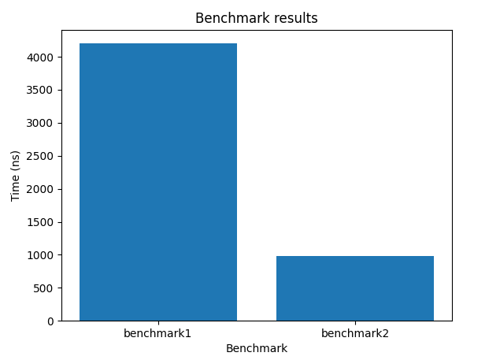

# **Лабораторная работа №**5

### **Тема**:

#### Алгоритмы на графах

### **Вариант:**

#### Топологическая сортировка и матрица смежности

### **_Что нужно было сделать_:**

Реализовать алгоритм топологической сортировки. 

Топологической сортировка графа состоит в следующем:  указать такой линейный порядок на его вершинах, чтобы любое ребро вело  от вершины с меньшим номером к вершине с большим номером. Если в графе есть циклы, то такого порядка не существует.  Рассматриваются только конечные ориентированные графы.  

Было необходимо предусмотреть ввод и вывод входных данных через текстовые фалы.  Возможность ввода команд из текстового файла предусмотрена.

### Как работает алгоритм

 Запускаем обход в глубину, и когда вершина обработана, заносим ее в  стек. По окончании обхода в глубину вершины достаются из стека. Новые  номера присваиваются в порядке вытаскивания из стека. Цвет: во время обхода в глубину используется 3 цвета. Изначально  все вершины белые. Когда вершина обнаружена, красим ее в серый цвет.  Когда просмотрен список всех смежных с ней вершин, красим ее в черный  цвет.

**Создано 5 тестов  с помощью GTEST и 2 бенчмарка, которые сравнивают время работы алгоритма на разных входных данных**  

<pre>
    ├── lab                                    # Кодовая база лабораторной работы
        │   ├── Lab-AISD-5.cpp                 # Фйал содержащий функцию main
        │   ├── tests.cpp                      # файл содержащий инициализацию функций для 5 тестов
        │   ├── sort.cpp                       # Файл содержащий инициализацию функций для тополгической сортировки.
        │   ├── sort.hpp                         # файл содержащий объявления функций для для тополгической сортировки.
        │   ├── stack.cpp                       # Файл содержащий инициализацию функций для стека.
        │   ├── stack.hpp                         # файл содержащий объявления функций для стека.
        │   ├── benchmark.cpp                       # Файл содержащий бенчмарки.
    │   ├── README.md                          # Описание вашего проекта, с описанием файлов и с титульником о том, что было сделанно
</pre>

### результаты бенчмарков:diagram.py

В первом бенчмарке топологическая сортировка запущенна от 15 вершин.

В втором бенчмарке топологическая сортировка запущенна от 4 вершин.
